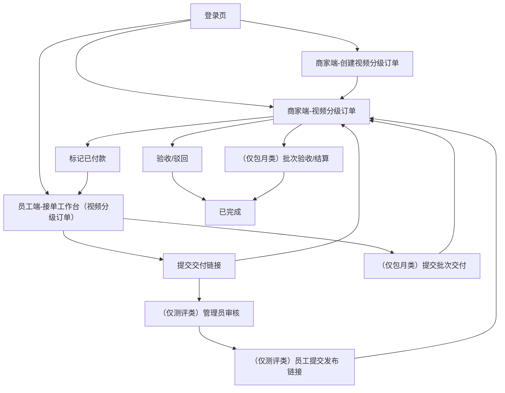

## 1. Product Overview
为商家端「视频分级订单」模块新增并整合 4 类订单类型，并同步适配员工端接单与交付流程。
在不改变既有业务流程与状态机逻辑的前提下，实现类型可选、可见、可筛选、可按既有规则流转。

## 2. Core Features

### 2.1 User Roles
| 角色 | 注册/登录方式 | Core Permissions |
|------|----------------|------------------|
| 商家（Client） | 使用账号密码登录 | 创建/查看视频订单；线下付款标记；对交付结果验收/驳回；包月批次验收与结算（如该类型支持） |
| 员工（Employee） | 使用账号密码登录 | 查看可处理订单；接单；更新流程阶段；提交交付链接；（特定类型）提交发布链接/包月批次交付 |

### 2.2 Feature Module
本次需求由以下核心页面组成：
1. **登录页**：账号密码登录、角色分流。
2. **商家端-视频分级订单**：按“4类订单类型”统一查看/筛选、查看详情、付款标记、验收/驳回、包月批次验收/结算。
3. **商家端-创建视频分级订单**：选择订单类型、填写订单信息、提交创建。
4. **员工端-接单工作台（视频分级订单）**：订单列表筛选、接单、流程推进、交付/发布/批次提交。

> 4 类订单类型（整合范围）
> - graded_video：分级视频（A/B/C）
> - high_quality_custom_video：高质量定制视频
> - monthly_package：包月长期合作套餐
> - creator_review_video：Creator 带货测评视频

### 2.3 Page Details
| Page Name | Module Name | Feature description |
|-----------|-------------|---------------------|
| 登录页 | 登录表单 | 输入用户名/密码并登录；根据账号角色跳转到对应工作台（商家/员工）。 |
| 商家端-视频分级订单 | 类型整合视图 | 展示 4 类订单类型的统一列表；支持按类型/状态/关键词筛选；不改变既有排序与分页策略（如已有）。 |
| 商家端-视频分级订单 | 订单详情（抽屉或详情区） | 查看订单基础信息（类型、标题、金额、需求等）与状态；展示员工交付链接/发布链接/包月批次信息（若存在）。 |
| 商家端-视频分级订单 | 付款与验收 | 线下付款标记（mark paid）；按既有规则执行验收（accept）或驳回（reject），并展示对应错误提示（如未付款/未交付/未发布等）。 |
| 商家端-视频分级订单 | 包月批次操作（仅 monthly_package） | 对指定批次执行验收（monthly-batches accept）与结算（monthly-batches settle）；展示批次状态、数量、备注与时间戳。 |
| 商家端-创建视频分级订单 | 类型选择 | 选择 4 类之一作为订单类型；仅展示“对商家可见”的类型（由配置决定），保持既有可见性规则不变。 |
| 商家端-创建视频分级订单 | 基础信息填写 | 填写标题、金额、需求（requirements）；分级视频支持录入分级相关信息（如 A/B/C 档位需求），字段结构保持与既有 requirements 兼容。 |
| 商家端-创建视频分级订单 | 提交创建 | 提交创建并返回新订单 ID；创建成功后跳转订单列表并高亮/定位新订单（若已有该交互则保持）。 |
| 员工端-接单工作台（视频分级订单） | 列表与筛选 | 查看已付款且“未分配或分配给我”的订单列表；按类型/阶段/关键词筛选；类型列表扩展为 4 类且不改变筛选语义。 |
| 员工端-接单工作台（视频分级订单） | 接单与阶段推进 | 对订单执行接单（claim）；按既有允许的 phase 集合更新阶段（patch phase），不新增/变更状态机含义。 |
| 员工端-接单工作台（视频分级订单） | 交付提交 | 提交交付链接（submit-proof）；对 creator_review_video 按既有逻辑进入 review_pending，否则进入 delivered。 |
| 员工端-接单工作台（视频分级订单） | 发布提交（仅 creator_review_video） | 在管理员审核通过（approved_to_publish）后提交发布链接（publish），并进入 published。 |
| 员工端-接单工作台（视频分级订单） | 包月批次交付（仅 monthly_package） | 提交批次交付（monthly-batches submit），写入批次 payload 并将订单阶段置为 delivered（保持既有逻辑）。 |

## 3. Core Process
### 商家（Client）主流程
1) 登录进入商家工作台。
2) 创建视频订单：选择 4 类类型之一并提交。
3) 线下收款后标记“已付款”。
4) 等待员工接单与交付：
- 非测评类（含 graded_video / high_quality_custom_video / monthly_package）：员工提交交付链接后，商家验收或驳回。
- 测评类（creator_review_video）：员工先提交交付进入“待审核”，管理员审核通过后员工提交发布链接，随后商家验收或驳回。
5) 完成后订单进入“已完成”。

### 员工（Employee）主流程
1) 登录进入员工工作台。
2) 在可处理列表中筛选并接单。
3) 推进阶段并提交交付：
- 提交交付链接；若为测评类则等待审核并提交发布链接。
- 若为包月类则按批次提交交付。
4) 若商家驳回，则按既有规则补充交付并再次提交。

