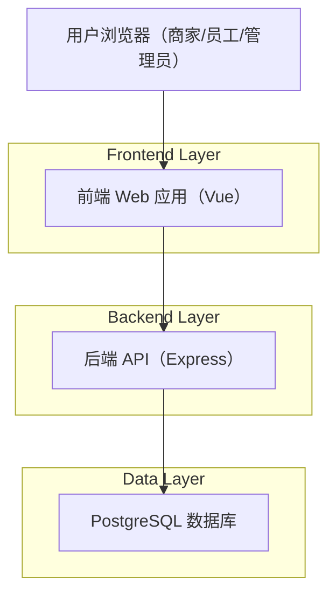
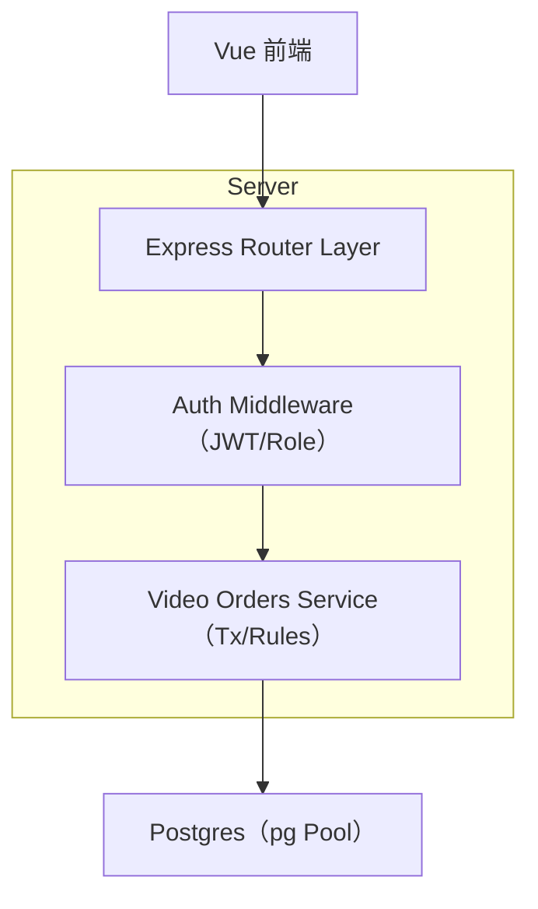
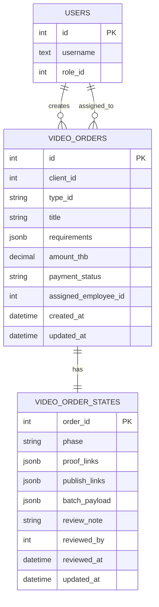

## 1.Architecture design


## 2.Technology Description
- Frontend: Vue@3 + vue-router@4 + pinia@2 + element-plus@2 + vite
- Backend: Node.js + Express@5 + TypeScript
- Database: PostgreSQL（通过 pg 连接）

## 3.Route definitions
（以现有 Vue Router 为准）
| Route | Purpose |
|-------|---------|
| /login | 登录页，完成鉴权与角色分流 |
| /client/video-orders | 商家端视频订单列表/详情/操作入口（统一 4 类类型） |
| /client/video-orders/create | 商家端创建视频订单 |
| /employee/video-orders | 员工端接单工作台（筛选/接单/交付/发布/批次提交） |
| /admin/video-orders | 管理员查看视频订单列表；（仅测评类）审核操作 |

## 4.API definitions
### 4.1 Shared Types（TypeScript 逻辑类型）
```ts
type VideoOrderTypeId =
  | "graded_video"
  | "high_quality_custom_video"
  | "monthly_package"
  | "creator_review_video";

type VideoOrderPhase =
  | "created"
  | "paid"
  | "assigned"
  | "in_progress"
  | "submitted"
  | "review_pending"
  | "review_rejected"
  | "approved_to_publish"
  | "published"
  | "delivered"
  | "completed"
  | "rejected";

interface VideoOrder {
  id: number;
  client_id: number;
  type_id: VideoOrderTypeId;
  title: string;
  requirements: Record<string, unknown>;
  amount_thb: number;
  payment_status: "unpaid" | "paid";
  assigned_employee_id: number | null;
  phase: VideoOrderPhase;
  proof_links: any[];
  publish_links: any[];
  batch_payload: any[];
  created_at: string;
  updated_at: string;
}
```

### 4.2 Client（商家端）
- 创建订单：`POST /client/video-orders`
- 列表：`GET /client/video-orders`
- 详情：`GET /client/video-orders/:id`
- 标记已付款：`POST /client/video-orders/:id/mark-paid`
- 验收完成：`POST /client/video-orders/:id/accept`
- 驳回：`POST /client/video-orders/:id/reject`
- 包月批次验收：`POST /client/video-orders/:id/monthly-batches/:batchNo/accept`
- 包月批次结算：`POST /client/video-orders/:id/monthly-batches/:batchNo/settle`

### 4.3 Employee（员工端）
- 列表：`GET /employee/video-orders?type=&phase=&q=&limit=`
- 接单：`POST /employee/video-orders/:id/claim`
- 更新阶段：`PATCH /employee/video-orders/:id/phase`
- 提交交付链接：`POST /employee/video-orders/:id/submit-proof`
- 提交发布链接（仅测评类）：`POST /employee/video-orders/:id/publish`
- 提交包月批次交付（仅包月类）：`POST /employee/video-orders/:id/monthly-batches/submit`

### 4.4 Admin（管理员端）
- 列表：`GET /admin/video-orders?type=&phase=&q=&limit=`
- 审核（仅测评类）：`POST /admin/video-orders/:id/review`（action=approve|reject）

### 4.5 本次“4 类类型整合”的关键兼容点（不改变现有逻辑）
1) **类型扩展为“可加性”**：在前端类型下拉/筛选中新增 `graded_video`，其余类型逻辑不变。
2) **后端类型校验保持原规则**：仅将 `graded_video` 纳入允许集合；阶段流转规则沿用“非测评类=delivered，测评类=review_pending/发布链路”。
3) **可见性沿用配置**：类型对不同角色的可见性继续由 `config.cooperation_types_v1` 决定。

## 5.Server architecture diagram


## 6.Data model
### 6.1 Data model definition


### 6.2 Data Definition Language
> 目标：在不影响既有订单的情况下，将 `graded_video` 纳入 video_orders 的类型范围。

Video Orders（video_orders）
```sql
-- 关键：放宽/更新 type_id 的约束，使其包含 graded_video
-- 注：不同环境的约束名可能不同；以实际数据库为准
ALTER TABLE video_orders DROP CONSTRAINT IF EXISTS video_orders_type_id_check;
ALTER TABLE video_orders
  ADD CONSTRAINT video_orders_type_id_check
  CHECK (type_id IN ('graded_video','high_quality_custom_video','monthly_package','creator_review_video'));

-- 建议索引（若未存在）
CREATE INDEX IF NOT EXISTS idx_video_orders_type ON video_orders(type_id, id DESC);
```

Config（config）
```sql
-- cooperation_types_v1 中应包含 graded_video 且对 client/employee/admin 可见
--（如已存在则无需变更；保持“现有逻辑不变”）
```
