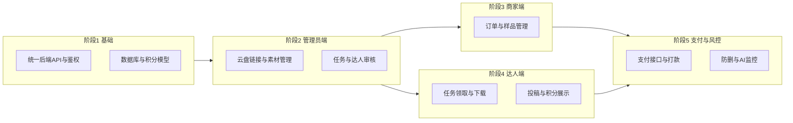

# 达人分发 APP 项目实现路线图与任务清单

## 文档说明

本文档基于《达人分发APP项目开发与实施计划》与《达人短视频分发APP》思维导图整理，用于指导项目分阶段开发与任务跟踪。与项目内 [PRD.md](PRD.md) 的对应关系如下：

- **角色与端口**：对应 PRD 第 2 节（管理员端、达人端、商家端）。
- **核心功能**：对应 PRD 第 3 节（视频存储与分发、任务与积分闭环、防删机制与审核流程）。
- **端口设置与达人匹配**：对应 PRD 第 4、5 节。
- **安全与风控**：对应 PRD 第 6 节。

技术栈与现有代码对齐：后端 [backend](backend/)（Express + TypeScript），前端 [frontend](frontend/)（Vite + React + TypeScript）。

---

## 项目实现路线图（简版）

核心策略：利用低成本劳动力优势，通过 APP 平台实现短视频批量生产与分发，建立泰国市场达人带货生态；**需优先解决支付风控和技术实现问题**。

| 阶段 | 目标 | 依赖 |
|------|------|------|
| 阶段 1 | 统一 API、鉴权、积分数据模型 | — |
| 阶段 2 | 管理员端：云盘上传、任务、达人审核、积分管理 | 阶段 1 |
| 阶段 3 | 商家端：样品、订单跟踪、作品与数据查看 | 阶段 2 |
| 阶段 4 | 达人端：任务领取、下载、投稿、积分展示 | 阶段 2 |
| 阶段 5 | 支付打款、防删巡检、违规黑名单 | 阶段 2、3、4 |

---

## 任务清单（可勾选）

### 阶段 1：基础架构与数据模型

#### 后端

- [x] 设计并实现用户表、角色表（管理员/商家/达人）（优先级：高）（模块：基础）
- [x] 实现 JWT 登录与 Refresh Token、角色鉴权中间件（优先级：高）（模块：基础）
- [x] 设计并实现积分账户表、积分流水表（优先级：高）（模块：基础）
- [x] 实现积分比例配置（1 积分 = 1 泰铢，可配置）（优先级：中）（模块：基础）
- [x] 实现 request-id 贯穿与审计日志表及写入（优先级：中）（模块：基础）
- [x] 实现登录/关键操作限流与防刷基础（优先级：中）（模块：基础）
- [x] 可选：规划并执行 SQLite/sql.js 至 Postgres 或 MySQL 迁移（优先级：低）（模块：基础）

#### 管理员端 / 商家端 / 达人端（本阶段仅基础）

- [x] 前端：登录页与 JWT 存储、请求头携带（优先级：高）（模块：基础）
- [x] 前端：按角色跳转不同入口或路由（管理员/商家/达人）（优先级：高）（模块：基础）

---

### 阶段 2：管理员端（云盘与任务核心）

#### 后端

- [x] 设计并实现素材表（标题、类型露脸/讲解、云盘链接、适合平台、备注）（优先级：高）（模块：管理员端）
- [x] 实现素材 CRUD API（录入、上下架、云盘链接维护）（优先级：高）（模块：管理员端）
- [x] 设计并实现任务表（关联素材、类型、目标平台、可领取数量、积分奖励）（优先级：高）（模块：管理员端）
- [x] 实现任务创建、发布、列表与筛选 API（优先级：高）（模块：管理员端）
- [x] 设计并实现达人资料表与标签（露脸/讲解、人设、主攻平台、黑名单）（优先级：高）（模块：管理员端）
- [x] 实现达人审核、打标签、等级与黑名单 API（优先级：高）（模块：管理员端）
- [x] 设计并实现投稿表（任务 ID、达人 ID、作品链接、状态、提交时间）（优先级：高）（模块：管理员端）
- [x] 实现投稿列表（待审核/已通过/已驳回）、通过/驳回 API，通过时写积分流水（优先级：高）（模块：管理员端）
- [x] 实现积分汇总、积分流水查询、按周统计 API（优先级：中）（模块：管理员端）
- [x] 实现审计日志查询与 CSV 导出 API（优先级：低）（模块：管理员端）

#### 管理员端（前端）

- [x] 素材管理页：视频录入表单（标题、类型、云盘链接、平台、备注）、列表与上下架（优先级：高）（模块：管理员端）
- [x] 任务管理页：创建任务（关联素材、积分、平台、限制条件）、任务列表与筛选（优先级：高）（模块：管理员端）
- [x] 达人管理页：达人列表、审核通过/驳回、打标签、黑名单操作（优先级：高）（模块：管理员端）
- [x] 投稿审核页：待审核列表（达人、任务、作品链接、提交时间）、通过/驳回操作与驳回原因（优先级：高）（模块：管理员端）
- [x] 积分与结算页：积分汇总、流水查询、按周统计展示（优先级：中）（模块：管理员端）
- [x] 审计与统计：操作日志查询、基础统计报表（优先级：低）（模块：管理员端）

---

### 阶段 3：商家端（样品与订单）

#### 后端

- [x] 设计并实现商家任务/需求表（产品信息、目标平台、预算、是否露脸）（优先级：高）（模块：商家端）
- [x] 实现商家合作信息与样品寄送记录表及 API（优先级：高）（模块：商家端）
- [x] 实现订单跟踪系统 API（状态、时间节点、关联达人/任务）（优先级：高）（模块：商家端）
- [x] 实现商家查看达人发布作品列表 API（优先级：高）（模块：商家端）
- [x] 实现视频单量、播放量等 API 接口数据（为后续投流码/报表预留）（优先级：中）（模块：商家端）
- [x] 商家端充值得积分接口与流水（优先级：中）（模块：商家端）

#### 商家端（前端）

- [x] 合作意向与任务需求提交页（产品、平台、预算、是否露脸）（优先级：高）（模块：商家端）
- [x] 样品寄送与订单跟踪页（列表、状态、时间线）（优先级：高）（模块：商家端）
- [x] 达人已发布作品列表与基础数据展示（优先级：高）（模块：商家端）
- [x] 视频下载（露脸/讲解）说明与按组下载、防关联说明（优先级：中）（模块：商家端）
- [x] 积分充值页与积分余额展示（优先级：中）（模块：商家端）

---

### 阶段 4：达人端（任务领取与投稿）

#### 后端

- [x] 实现任务大厅 API（按平台、类型露脸/讲解、积分排序与筛选）（优先级：高）（模块：达人端）
- [x] 实现任务领取 API：记录领取关系、校验每日领取上限（优先级：高）（模块：达人端）
- [x] 实现「我的任务」API（已领取任务及状态：未发布/待审核/已通过/被驳回/锁定期/已结算）（优先级：高）（模块：达人端）
- [x] 提供视频下载链接（模式1/模式2）与云盘跳转或复制（优先级：高）（模块：达人端）
- [x] 实现达人投稿回填 API（作品链接、可选说明）、状态更新为待审核（优先级：高）（模块：达人端）
- [x] 实现达人端积分与本周预计结算、历史收益与流水查询 API（优先级：高）（模块：达人端）
- [x] 露脸任务仅对露脸达人/指定达人池开放（权限与匹配逻辑）（优先级：高）（模块：达人端）
- [x] 领取与下载限流、领取记录审计日志（优先级：中）（模块：达人端）

#### 达人端（前端）

- [x] 任务大厅页：卡片列表（封面、标题、类型、平台、积分）、筛选与排序（优先级：高）（模块：达人端）
- [x] 任务详情与领取：查看要求、一键领取、每日上限提示（优先级：高）（模块：达人端）
- [x] 我的任务页：已领取任务列表及状态、打开云盘/复制下载链接（优先级：高）（模块：达人端）
- [x] 投稿反馈：提交作品链接与说明、查看审核意见与驳回原因（优先级：高）（模块：达人端）
- [x] 积分与收益页：当前积分、本周预计结算、历史收益与流水（优先级：高）（模块：达人端）
- [x] 违规/扣分/锁定期提示展示（优先级：中）（模块：达人端）

---

### 阶段 5：支付系统与风控机制

#### 后端

- [x] 结算周期配置（一周打款周期）、上周有效积分汇总 API（优先级：高）（模块：支付与风控）
- [x] 结算报表导出（CSV/Excel）：达人、积分、打款状态（优先级：高）（模块：支付与风控）
- [x] 对接小额支付接口（泰国本地或通用）：打款请求与回调（优先级：高）（模块：支付与风控）
- [x] 打款状态标记（未结算/已结算/异常）及重试策略（优先级：高）（模块：支付与风控）
- [x] 锁定期配置（如 3/5 天）与锁定期内作品标记（优先级：高）（模块：支付与风控）
- [x] 作品链接定时巡检（可访问性）：脚本或 ChatGPT 分析删除状态（优先级：高）（模块：支付与风控）
- [x] 巡检结果写入（正常/疑似删除/违规）、告警与阻止自动结算（优先级：高）（模块：支付与风控）
- [x] 锁定期内删除：违约标记、扣分规则（全额或比例可配置）（优先级：高）（模块：支付与风控）
- [x] 三次违规列入黑名单、限制领取或封禁（优先级：高）（模块：支付与风控）
- [x] 实时或准实时监控播放量/转化率落库与简单告警（优先级：中）（模块：支付与风控）
- [x] 可选：相似度/查重接口预留或接入（优先级：低）（模块：支付与风控）

#### 管理员端（前端）- 阶段 5 扩展

- [x] 结算与打款页：导出报表、标记打款状态、异常处理（优先级：高）（模块：支付与风控）
- [x] 防删巡检结果与告警列表、人工复核入口（优先级：高）（模块：支付与风控）
- [x] 黑名单与违规记录查看、解锁/降级操作（优先级：中）（模块：支付与风控）

---

## 风险与依赖说明

### 高风险项及建议完成顺序

1. **支付系统（项目跟进表：高风险）**  
   - 先完成结算周期与报表导出，再对接真实支付渠道；打款状态与异常需人工复核兜底。  
   - 依赖：泰国小额支付接口资质与文档。

2. **达人端（项目跟进表：高风险）**  
   - 在阶段 4 必须上线「每日领取上限」与领取/下载限流，避免刷单与资源滥用。  
   - 依赖：阶段 1 审计日志与限流基础。

3. **风控机制（开发计划：存在风险）**  
   - 防删巡检优先用脚本检测链接可访问性；ChatGPT 分析可作为增强，需考虑成本与延迟。  
   - 三次违规黑名单与扣分规则需在阶段 5 与投稿审核、积分流水联动。

### 外部依赖

| 依赖项 | 说明 | 建议 |
|--------|------|------|
| 云盘 API / 链接规范 | 谷歌云盘、百度网盘、OSS 等链接格式与稳定性 | 先支持通用链接录入与跳转，再按需做直传或解析 |
| 支付渠道 | 泰国小额打款、手续费与到账周期 | 提前选定 1–2 家并完成签约与沙箱联调 |
| AI 巡检方式 | ChatGPT 或自建脚本检测作品删除/违规 | 先脚本可访问性检测，再扩展 AI 内容安全 |
| 播放量/转化数据 | 平台开放接口或爬取合规性 | 先预留 API 与落库结构，再接入合规数据源 |

---

## 与项目跟进表对应表

| 项目跟进表模块 | 状态 | 对应阶段 | 对应任务摘要（本章节） |
|----------------|------|----------|------------------------|
| 商家端 | 待开发 | 阶段 3 | 商家任务/样品/订单跟踪、作品列表、积分充值；前端合作意向、订单跟踪、作品展示 |
| 管理员端 | 待开发 | 阶段 2 | 素材与云盘链接、任务、达人审核、投稿审核、积分与流水；前端素材/任务/达人/投稿/积分页 |
| 达人端 | 高风险 | 阶段 4 | 任务大厅、领取上限、我的任务、下载链接、投稿回填、积分与收益；前端任务大厅/我的任务/投稿/积分页；限流与审计在阶段 1/4 |
| 支付系统 | 高风险 | 阶段 5 | 一周打款周期、结算报表、小额支付对接、打款状态；防删与违规在阶段 5 风控小节 |

---

*文档版本：1.0 | 基于开发实施计划与思维导图整理，与 PRD 对齐*
